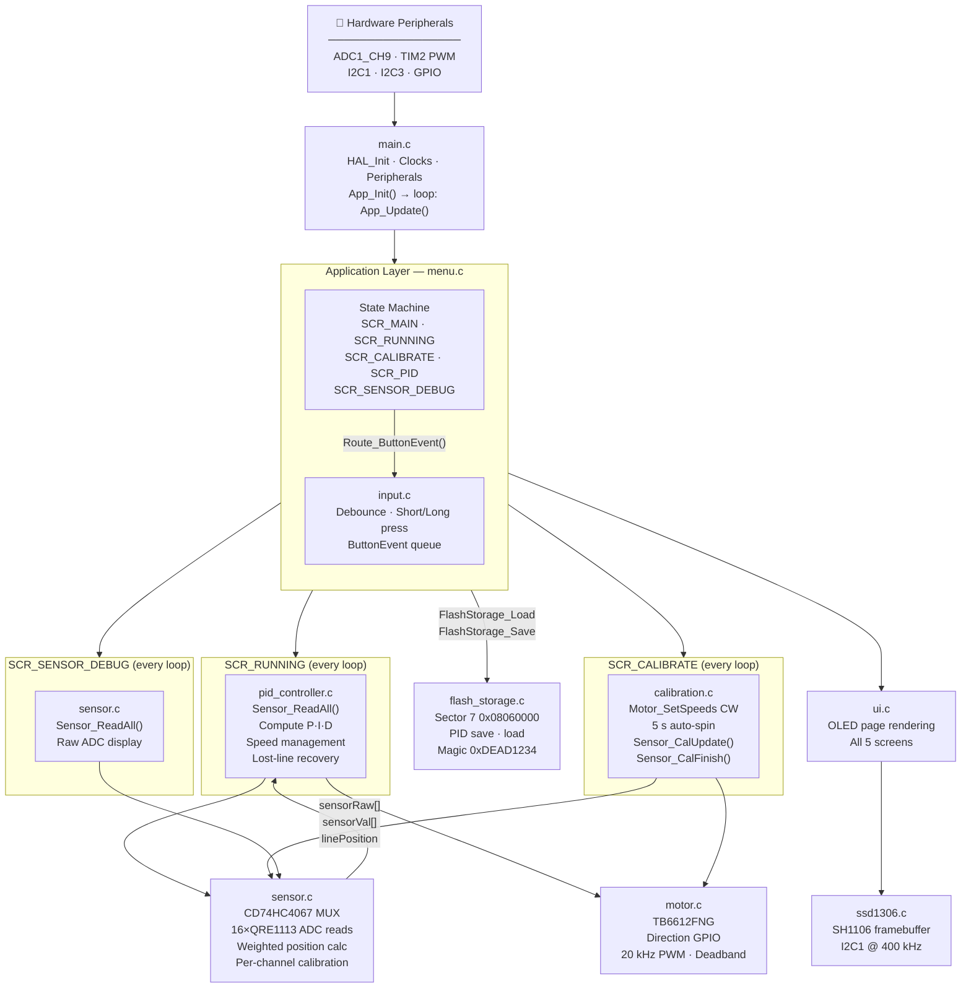

# Line Follower — STM32F411CE

A PID-based line follower robot firmware for the STM32F411CEU6 (Black Pill), using a 16-channel QRE1113 SMD IR sensor array, TB6612FNG dual motor driver, and a 1.3" SH1106 OLED display.

---

## Hardware

| Component | Part | Notes |
|---|---|---|
| MCU | STM32F411CEU6 (Black Pill) | 100 MHz Cortex-M4F |
| IR sensors | QRE1113 SMD ×16 | Multiplexed through CD74HC4067SM |
| MUX | CD74HC4067SM | 16-channel analog MUX |
| Motor driver | TB6612FNG | Dual H-bridge |
| Motors | N20 1000 RPM 12 V | With gearbox |
| Display | SH1106 1.3" OLED 128×64 | I2C |
| IMU | ICM-42688 | I2C (reserved, unused in current firmware) |

### Pin Map

#### Motor Driver (TB6612FNG)
| Signal | Pin | Description |
|---|---|---|
| AIN1 | PA2 | Left motor direction 1 |
| AIN2 | PA3 | Left motor direction 2 |
| PWMA | PA0 (TIM2_CH1) | Left motor PWM |
| BIN1 | PC14 | Right motor direction 1 |
| BIN2 | PC15 | Right motor direction 2 |
| PWMB | PA1 (TIM2_CH2) | Right motor PWM |
| STBY | PA4 | Standby (LOW = coast, HIGH = enable) |

#### Sensor MUX (CD74HC4067SM)
| Signal | Pin | Description |
|---|---|---|
| S0 | PB0 | Channel select bit 0 |
| S1 | PA7 | Channel select bit 1 |
| S2 | PA6 | Channel select bit 2 |
| S3 | PA5 | Channel select bit 3 |
| SIG | PB1 (ADC1_CH9) | Analog signal from active sensor |

Sensor layout: I0 = rightmost (+), I15 = leftmost (−).  
I0–I1 and I14–I15 are curved outward; I2–I13 are straight at 8 mm pitch.

#### Display (SH1106 OLED)
| Signal | Pin |
|---|---|
| SCL | PB6 (I2C1) |
| SDA | PB7 (I2C1) |

#### IMU (ICM-42688)
| Signal | Pin |
|---|---|
| SCL | PA8 (I2C3) |
| SDA | PB4 (I2C3) |

#### Buttons & Indicator
| Signal | Pin | Description |
|---|---|---|
| L (Left) | PB12 | Navigate left / decrease value |
| E (Enter) | PB13 | Confirm / short or long press |
| R (Right) | PB14 | Navigate right / increase value |
| LED | PB10 | Status indicator |

---

## Firmware Architecture

The firmware is a flat event-driven state machine. `main.c` initialises peripherals and calls `App_Update()` in a tight loop. All application logic is split into focused modules.

```
main.c
 └─ App_Update()  [menu.c — state machine coordinator]
      ├─ Input_Update()        [input.c]
      ├─ Route_ButtonEvent()   [menu.c]
      ├─ PID_Update()          [pid_controller.c]  ← SCR_RUNNING only
      ├─ Calibration_Update()  [calibration.c]     ← SCR_CALIBRATE only
      ├─ Sensor_ReadAll()      [sensor.c]           ← SCR_SENSOR_DEBUG only
      └─ UI_Refresh()          [ui.c]
```



### Module Overview

| File | Responsibility |
|---|---|
| `menu.c` / `menu.h` | App state machine, screen routing, button event dispatch, PID config globals |
| `pid_controller.c` | PID computation, speed management, lost-line recovery, motor output |
| `sensor.c` | MUX sequencing, ADC reads, position calculation, auto-calibration data |
| `calibration.c` | Auto-spin calibration: drives motors, collects min/max, computes thresholds |
| `motor.c` | TB6612FNG direction + PWM control |
| `input.c` | Button debouncing, short/long press detection, event queue |
| `ui.c` | All OLED screen rendering |
| `flash_storage.c` | Save/load PID config to/from internal flash Sector 7 |
| `ssd1306.c` | Low-level SH1106 I2C driver (page-mode framebuffer) |
| `icm42688.c` | ICM-42688 IMU driver (reserved) |

---

## Application Screens

Navigation uses the **L / R** buttons to cycle pages and **E** to confirm.  
A **long press of E** from any screen returns immediately to the main menu and stops the motors.

### 1. Main Menu (pages 1–4)

Navigation uses the **L / R** buttons to cycle pages and **E** to confirm.  
A **long press of E** from any screen returns immediately to the main menu and stops the motors.

| Page | Content |
|---|---|
| 1/4 START RUN | Launches line-following. Blocked if not calibrated. Shows Kp/Kd/Speed/Cal status. |
| 2/4 CALIBRATE | Place robot on track, press E — auto-spin starts immediately. |
| 3/4 PID SETTINGS | Preview of current Kp/Ki/Kd/Speed. Press E to enter edit mode. |
| 4/4 SENSOR DEBUG | Enters the live sensor value screen. |

### 2. Running Screen (`SCR_RUNNING`)

Displays live data while the robot follows the line:
- 16-sensor binary bar (`*` = on line, `.` = off)
- Pixel-accurate position bar (proportional to `linePosition`)
- Direction indicator: `<< LEFT`, `CENTRED`, `RIGHT >>`
- Error value and current base speed

Press **E** (short or long) to stop motors and return to main menu.

### 3. Calibration Screen (`SCR_CALIBRATE`)

1. Navigate to page **2/4 CALIBRATE** on the main menu.
2. Place the robot on the track so the sensor array spans both the black line and white surface.
3. Press **E** — the spin starts **immediately** (no second confirmation screen).
4. The robot pivots **clockwise** at a fixed 20% speed for **5 seconds** while all 16 sensors continuously record their min and max ADC values.
5. Motors stop automatically, per-channel thresholds are computed, and the display returns to the main menu with `Status:[CALIBRATED]`.

During spin the display shows:
- Live sensor bar (which sensors currently see the line)
- Per-sensor confidence bar (filled block = that channel has seen enough ADC swing)
- `Ready: X/16` count
- Countdown timer (`4.2s left`)

Press **E or L** at any time to **abort** (motors stop, calibration data discarded, no thresholds written).

> **Note:** Calibration spin speed (30%) is a fixed constant `CAL_SPIN_SPEED` in `calibration.c` and is completely independent of `pid.baseSpeed`.

### 4. PID Tuning Screen (`SCR_PID`)

Adjust the four PID parameters live:

| Field | Step | Range |
|---|---|---|
| Kp | ±0.10 | 0.0 – 10.0 |
| Ki | ±0.01 | 0.0 – 2.0 |
| Kd | ±0.05 | 0.0 – 5.0 |
| Speed | ±5 % | 0 – 100 % |

- **L/R** moves the cursor between fields.
- **E** toggles edit mode on the selected field (cursor shows `>` idle, `*` editing).
- Scroll to the **SAVE** row and press **E** to write to flash (persists across power cycles).

### 5. Sensor Debug Screen (`SCR_SENSOR_DEBUG`)

Shows all 16 raw 12-bit ADC values (0–4095) updating at 10 Hz:

```
 0:XXXX*  8:XXXX.
 1:XXXX.  9:XXXX.
 ...
 7:XXXX. 15:XXXX.
```

`*` = sensor currently above threshold (on line), `.` = off.  
Press **E or L** to return to the main menu.

---

## PID Controller

### Position Encoding

The 16 sensors map to a signed position value:

| Sensor | Position (units) |
|---|---|
| I0 (rightmost, curved) | +8500 |
| I1 (curved) | +7000 |
| I2–I13 (straight, 8 mm pitch) | +5500 … −5500 |
| I14 (curved) | −7000 |
| I15 (leftmost, curved) | −8500 |

Curved sensors get extra reach (`SENSOR_CURVE_EXTRA = 500 units`). Adjust this in `sensor.h` if the robot cuts corners.

### Position Calculation Modes

**After calibration (analog mode):**  
Each sensor contributes a continuous 0.0–1.0 intensity normalised by its own `calMin`/`calMax`. The position is a weighted average. Gives sub-sensor resolution and smooth PID input.

**Before calibration (binary mode):**  
Each sensor contributes 0 or 1 based on the global `SENSOR_THR_DEF = 2048`. Position is the average of all active sensor positions.

### PID Computation (every loop iteration)

```
error = linePosition
output = Kp×error + Ki×integral + Kd×derivative
steering = output × (100 / SENSOR_POS_MAX)

leftSpeed  = effectiveBase + steering
rightSpeed = effectiveBase − steering
```

**Derivative:** Low-pass filtered with `DERIV_ALPHA = 0.35` to reduce noise jitter.  
**Integral:** Reset on sign change to prevent windup during zigzag patterns. Clamped to `±8×SENSOR_POS_MAX`.

### Speed Management (automatic)

**Corner slowdown (quadratic):**
```
errNorm = |error| / SENSOR_POS_MAX        (0.0–1.0)
scale   = max(1 − 0.65×errNorm², 0.30)
```
At 100% error: 35% of base speed. At 50% error: 84% of base speed. Never below 30%.

**Straight-line boost:**  
When `errNorm < 0.12` (well-centred), speed is boosted up to +20%.

### Lost-Line Recovery

When `sensorActiveCount == 0` (no sensor sees the line):

| Phase | Duration | Behaviour |
|---|---|---|
| Coast | 0–60 ms | Hold last motor command (gap / cut mark) |
| Pivot | 60–600 ms | Slow pivot (18%) toward last-known line side |
| Hard brake | > 600 ms | Stop — fell off track or course end |

---

## Auto-Calibration Details

### Public API (`calibration.h`)

| Function | Description |
|---|---|
| `Calibration_Start()` | Enables motors, starts clockwise spin, resets min/max accumulators |
| `Calibration_Update()` | Called every loop — samples sensors, auto-finishes after `CAL_SPIN_MS` |
| `Calibration_Abort()` | Stops motors, discards data, resets to `CAL_IDLE` |
| `Calibration_IsDone()` | Returns 1 (once) when spin has finished and thresholds are written |
| `Calibration_TimeRemaining()` | Milliseconds left in current spin (0 if not spinning) |

### Internal flow

- `Sensor_CalStart()` — resets per-channel `min` to 4095 and `max` to 0.
- `Sensor_CalUpdate()` — called every loop during spin; updates running min/max per channel.
- `Sensor_CalFinish()` — called automatically when the timer expires: for each channel `threshold = (min + max) / 2`. Channels with ADC swing < 600 counts fall back to the global `SENSOR_THR_DEF`.
- `sensorCalibrated = 1` after finish — `Sensor_ReadAll()` switches to per-channel thresholds automatically.
- `Sensor_CalConfidence()` — count of channels with sufficient swing, shown on-screen during spin.

---

## Flash Storage

PID config is stored in **Sector 7** (`0x08060000`), the last 128 KB sector of the STM32F411CE.  
This leaves sectors 0–6 for firmware and avoids any overlap with the program image.

A `0xDEAD1234` magic number validates the stored data. On first boot (or after a full chip erase), defaults from `menu.c` are used:

```c
PIDConfig pid = {2.0f, 0.0f, 3.0f, 30};  // Kp, Ki, Kd, Speed%
```

> **Note:** Do not call `FlashStorage_Save()` while motors are running. The sector erase takes ~1 ms and stalls the CPU. The PID tuning screen is only accessible when stopped.

---

## Tuning Guide

### First Run

1. Flash firmware. Robot displays main menu.
2. Navigate to **CALIBRATE** (page 2/4 with **R**).
3. Place robot on track so sensors span both black line and white background.
4. Press **E** — robot immediately starts spinning clockwise for 5 seconds.
5. Watch the confidence bar fill — all 16 blocks should fill. If some don't, the array isn't reaching both surfaces during the spin.
6. After auto-return to main menu, `Status:[CALIBRATED]` and `Cal: DONE` appear.
7. Navigate to **PID** (page 3/4). Start with: `Kp=1.5`, `Ki=0.00`, `Kd=0.00`, `Speed=30`.
8. Return to page 1/4 and press **E** to start running.

### Suggested Tuning Sequence

| Step | Action |
|---|---|
| 1 | Kp=1.5, Ki=0, Kd=0, Speed=30 — robot wobbles but follows |
| 2 | Raise Kp until oscillation starts, back off ~20% |
| 3 | Raise Kd until oscillation stops — this is your main handle |
| 4 | Raise Speed, increase Kd again if wobbling returns |
| 5 | Add Ki (0.01–0.05) only if robot drifts persistently to one side |

### Geometry Tuning

If the robot cuts sharp corners, the curved sensors are reporting a position that is smaller (closer to centre) than the real physical position. Increase `SENSOR_CURVE_EXTRA` in `sensor.h` (default: 500 units = ~4 mm extra reach per curved step).

---

## Build

Built with **STM32CubeIDE** / **CMake + arm-none-eabi-gcc 14.3**.

```
cmake --preset Debug
cmake --build build/Debug
```

Flash with ST-Link via STM32CubeIDE or:
```
openocd -f interface/stlink.cfg -f target/stm32f4x.cfg \
        -c "program build/Debug/LineFollower.elf verify reset exit"
```

### Key Compile-Time Constants

| Constant | File | Default | Description |
|---|---|---|---|
| `SENSOR_CURVE_EXTRA` | `sensor.h` | 500 | Extra position units per curved sensor step |
| `SENSOR_THR_DEF` | `sensor.h` | 2048 | Global fallback ADC threshold (pre-calibration) |
| `CAL_SPIN_MS` | `calibration.c` | 5000 | Calibration spin duration (ms) |
| `CAL_SPIN_SPEED` | `calibration.c` | 20 | Calibration spin speed (%) — independent of pid.baseSpeed |
| `DERIV_ALPHA` | `pid_controller.c` | 0.35 | Derivative low-pass filter coefficient |
| `CORNER_DROP` | `pid_controller.c` | 0.65 | Quadratic corner slowdown factor |
| `MOTOR_DEADBAND` | `motor.c` | 150 | Minimum PWM tick to overcome motor stiction |

---

## Splash Screen (planned)

A 128×64 1-bit bitmap can be shown on boot for 3 seconds before the main menu appears.
To add one:
1. Prepare a 128×64 black-and-white image.
2. Convert it to a C byte array using **[image2cpp](https://javl.github.io/image2cpp/)** (Horizontal, 1 bit per pixel).
3. Save the output as `Core/Inc/splash.h`.
4. Call `ssd1306_DrawBitmap()` inside `App_Init()` followed by `HAL_Delay(3000)`.
