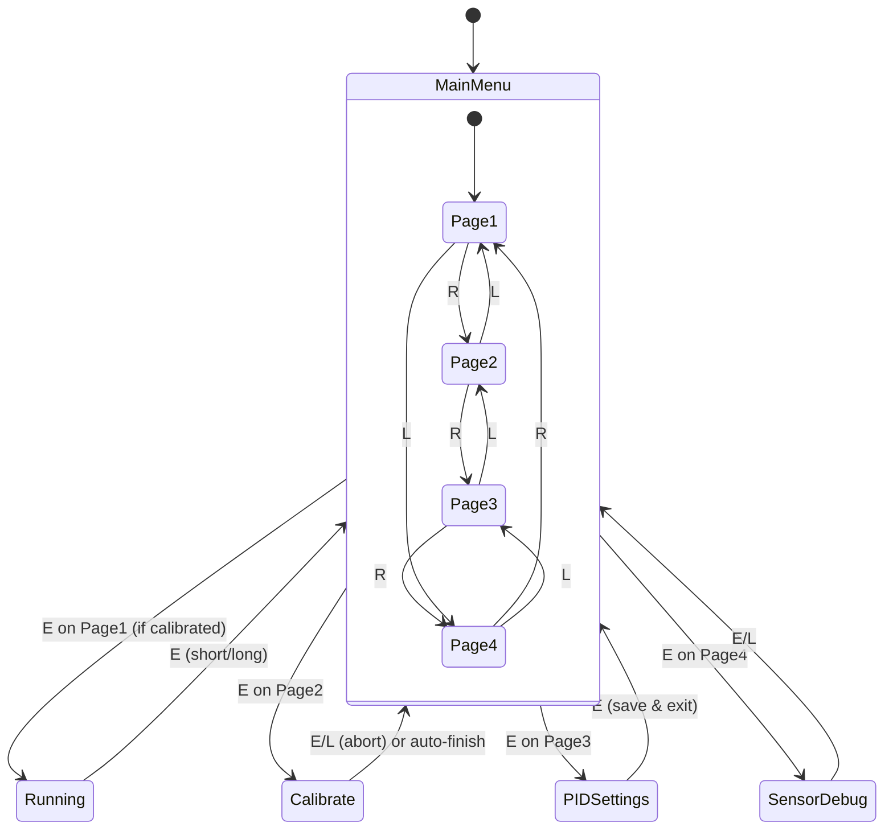
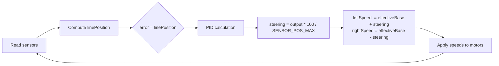

# Line Follower — STM32F411CE

A PID‑based line follower robot firmware for the STM32F411CEU6 (Black Pill), using a 16‑channel QRE1113 SMD IR sensor array, TB6612FNG dual motor driver, and a 1.3" SH1106 OLED display.

---

## Table of Contents

- [Hardware Overview](#hardware-overview)
- [Pin Mapping](#pin-mapping)
- [Firmware Architecture](#firmware-architecture)
- [Application Screens](#application-screens)
- [Key Algorithms](#key-algorithms)
  - [Sensor Reading & Position Calculation](#sensor-reading--position-calculation)
  - [PID Controller](#pid-controller)
  - [Speed Management](#speed-management)
  - [Lost‑Line Recovery](#lost-line-recovery)
  - [Auto‑Calibration](#auto-calibration)
- [Persistent Storage](#persistent-storage)
- [Build & Flashing](#build--flashing)
- [Tuning Guide](#tuning-guide)
- [Compile‑Time Constants](#compile-time-constants)
- [Future Improvements](#future-improvements)

---

## Hardware Overview

The robot is built around the **STM32F411CEU6** (Black Pill) and interfaces with the following peripherals:

| Component          | Part              | Notes                                    |
|--------------------|-------------------|------------------------------------------|
| MCU                | STM32F411CEU6     | 100 MHz Cortex‑M4F                       |
| IR sensors         | QRE1113 SMD ×16   | Multiplexed through CD74HC4067SM         |
| Analog MUX         | CD74HC4067SM      | 16‑channel                               |
| Motor driver       | TB6612FNG         | Dual H‑bridge, 1.2 A continuous          |
| Motors             | N20 1000 RPM 12 V | With gearbox (can be swapped for 6 V)    |
| Display            | SH1106 1.3" OLED  | 128×64, I²C                              |
| IMU                | ICM-42688         | I²C (reserved, unused in current firmware) |

**System Block Diagram**

```mermaid
flowchart LR
    subCPU[STM32F411<br/>Black Pill]
    subSens[16× QRE1113<br/>IR Sensors]
    subMUX[CD74HC4067<br/>16‑ch MUX]
    subMotor[TB6612FNG<br/>Motor Driver]
    subMotors[N20 Motors]
    subOLED[SH1106 OLED<br/>I²C]
    subButtons[Buttons<br/>L / E / R]
    subIMU[ICM-42688<br/>IMU (reserved)]

    subCPU -- ADC + GPIO --> subMUX
    subMUX -- analog --> subSens
    subCPU -- PWM + GPIO --> subMotor
    subMotor --> subMotors
    subCPU -- I²C1 --> subOLED
    subCPU -- GPIO --> subButtons
    subCPU -. I²C3 .-> subIMU
```

---

## Pin Mapping

### Motor Driver (TB6612FNG)

| Signal | Pin   | Description               |
|--------|-------|---------------------------|
| AIN1   | PA2   | Left motor direction 1    |
| AIN2   | PA3   | Left motor direction 2    |
| PWMA   | PA0   | Left motor PWM (TIM2_CH1) |
| BIN1   | PC14  | Right motor direction 1   |
| BIN2   | PC15  | Right motor direction 2   |
| PWMB   | PA1   | Right motor PWM (TIM2_CH2)|
| STBY   | PA4   | Standby (LOW = coast, HIGH = enable) |

### Sensor MUX (CD74HC4067SM)

| Signal | Pin   | Description                     |
|--------|-------|---------------------------------|
| S0     | PB0   | Channel select bit 0            |
| S1     | PA7   | Channel select bit 1            |
| S2     | PA6   | Channel select bit 2            |
| S3     | PA5   | Channel select bit 3            |
| SIG    | PB1   | Analog signal (ADC1_CH9)        |

**Sensor layout:**  
I0 (rightmost, curved) → I15 (leftmost, curved).  
I0–I1 and I14–I15 are curved outward; I2–I13 are straight with 8 mm pitch.

### Display (SH1106 OLED)

| Signal | Pin   | Description |
|--------|-------|-------------|
| SCL    | PB6   | I²C1 clock  |
| SDA    | PB7   | I²C1 data   |

### IMU (ICM-42688) – Reserved

| Signal | Pin   | Description |
|--------|-------|-------------|
| SCL    | PA8   | I²C3 clock  |
| SDA    | PB4   | I²C3 data   |

### Buttons & Indicator

| Signal | Pin   | Description                         |
|--------|-------|-------------------------------------|
| L      | PB12  | Navigate left / decrease value      |
| E      | PB13  | Confirm / short or long press       |
| R      | PB14  | Navigate right / increase value     |
| LED    | PB10  | Status indicator                    |

---

## Firmware Architecture

The firmware uses a **flat event‑driven state machine**. `main.c` initialises peripherals and calls `App_Update()` in a tight loop. All application logic is split into focused modules.

```mermaid
flowchart TD
    %% Hardware Layer
    subgraph HW [Hardware Peripherals]
        ADC["ADC1_CH9<br/>PB1"]
        TIM["TIM2_CH1/CH2<br/>PA0, PA1"]
        I2C1["I2C1<br/>PB6 (SCL), PB7 (SDA)"]
        I2C3["I2C3<br/>PA8 (SCL), PB4 (SDA)"]
        GPIO["GPIO<br/>MUX selects, motor direction, buttons, LED"]
        FLASH_INT["Internal Flash<br/>Sector 7"]
    end

    %% Driver Layer (low-level hardware abstraction)
    subgraph DRV [Drivers]
        SSD1306["ssd1306.c<br/>SH1106 framebuffer<br/>I2C1"]
        ICM42688["icm42688.c<br/>IMU driver<br/>(reserved, unused)"]
    end

    %% Middleware / Modules
    subgraph MOD [Modules]
        SENSOR["sensor.c<br/>MUX control, ADC reads<br/>per‑channel calibration<br/>weighted position"]
        MOTOR["motor.c<br/>TB6612FNG direction + PWM<br/>deadband handling"]
        PID["pid_controller.c<br/>PID computation<br/>speed management<br/>lost‑line recovery"]
        CAL["calibration.c<br/>auto‑spin routine<br/>min/max capture<br/>threshold calculation"]
        FLASH["flash_storage.c<br/>save/load PID config<br/>magic 0xDEAD1234"]
        INPUT["input.c<br/>button debounce<br/>short/long press detection<br/>event queue"]
        UI["ui.c<br/>render all 5 screens<br/>updates OLED via ssd1306"]
    end

    %% Application Layer
    MAIN["main.c<br/>HAL_Init, clocks, peripherals<br/>App_Init() then loop: App_Update()"]
    MENU["menu.c<br/>state machine coordinator<br/>SCR_MAIN, SCR_RUNNING, SCR_CALIBRATE,<br/>SCR_PID, SCR_SENSOR_DEBUG"]

    %% Connections: Hardware → Drivers/Modules
    ADC --> SENSOR
    TIM --> MOTOR
    GPIO --> SENSOR
    GPIO --> MOTOR
    GPIO --> INPUT
    I2C1 --> SSD1306
    I2C3 -.-> ICM42688   %% unused, dashed line
    FLASH_INT --> FLASH

    %% Drivers → Modules
    SSD1306 --> UI

    %% Modules → Modules (calls / data flow)
    MENU --> INPUT
    MENU --> UI
    MENU --> FLASH

    MENU -- SCR_RUNNING --> PID
    MENU -- SCR_CALIBRATE --> CAL
    MENU -- SCR_SENSOR_DEBUG --> SENSOR

    PID --> SENSOR
    PID --> MOTOR
    CAL --> SENSOR
    CAL --> MOTOR

    SENSOR --> PID    %% returns linePosition, raw values

    %% main → menu
    MAIN --> MENU
```

### Module Responsibilities

| File                 | Responsibility                                           |
|----------------------|----------------------------------------------------------|
| `menu.c`             | State machine, screen routing, button event dispatch, PID globals |
| `pid_controller.c`   | PID computation, speed management, lost‑line recovery, motor output |
| `sensor.c`           | MUX sequencing, ADC reads, position calculation, calibration data |
| `calibration.c`      | Auto‑spin calibration: drives motors, collects min/max, computes thresholds |
| `motor.c`            | TB6612FNG direction + PWM control                        |
| `input.c`            | Button debouncing, short/long press detection, event queue |
| `ui.c`               | All OLED screen rendering                                |
| `flash_storage.c`    | Save/load PID config to/from internal flash Sector 7     |
| `ssd1306.c`          | Low‑level SH1106 I²C driver (page‑mode framebuffer)      |
| `icm42688.c`         | ICM‑42688 IMU driver (reserved)                          |

---

## Application Screens

Navigation uses **L / R** buttons to cycle pages and **E** to confirm.  
A **long press of E** from any screen immediately returns to the main menu and stops the motors.



### 1. Main Menu (pages 1–4)

| Page | Content                                   |
|------|-------------------------------------------|
| 1/4  | START RUN – launches line‑following (blocked if not calibrated). Shows Kp/Kd/Speed/Cal status. |
| 2/4  | CALIBRATE – press E to start auto‑spin.  |
| 3/4  | PID SETTINGS – preview current Kp/Ki/Kd/Speed. Press E to enter edit mode. |
| 4/4  | SENSOR DEBUG – enters live sensor value screen. |

### 2. Running Screen (`SCR_RUNNING`)

Displays live data while following the line:
- 16‑sensor binary bar (`*` = on line, `.` = off)
- Pixel‑accurate position bar (proportional to `linePosition`)
- Direction indicator: `<< LEFT`, `CENTRED`, `RIGHT >>`
- Error value and current base speed

Press **E** (short or long) to stop motors and return to main menu.

### 3. Calibration Screen (`SCR_CALIBRATE`)

1. Navigate to page **2/4 CALIBRATE**.
2. Place robot so the sensor array spans both black line and white surface.
3. Press **E** – the spin starts **immediately**.
4. Robot pivots **clockwise** at a fixed speed (`CAL_SPIN_SPEED`) for `CAL_SPIN_MS` while recording min/max ADC values.
5. Motors stop automatically, per‑channel thresholds are computed, and the display returns to the main menu with `Status:[CALIBRATED]`.

During spin the display shows:
- Live sensor bar (which sensors currently see the line)
- Per‑sensor confidence bar (filled block = that channel has seen enough ADC swing)
- `Ready: X/16` count
- Countdown timer

Press **E or L** at any time to **abort** (motors stop, calibration data discarded).

### 4. PID Tuning Screen (`SCR_PID`)

Adjust the four PID parameters live:

| Field | Step  | Range      |
|-------|-------|------------|
| Kp    | ±0.10 | 0.0 – 10.0 |
| Ki    | ±0.01 | 0.0 – 2.0  |
| Kd    | ±0.05 | 0.0 – 5.0  |
| Speed | ±5%   | 0 – 100%   |

- **L/R** moves the cursor between fields.
- **E** toggles edit mode on the selected field (cursor shows `>` idle, `*` editing).
- Scroll to the **SAVE** row and press **E** to write to flash (persists across power cycles).

### 5. Sensor Debug Screen (`SCR_SENSOR_DEBUG`)

Shows all 16 raw 12‑bit ADC values (0–4095) updating at 10 Hz:

```
 0:XXXX*  8:XXXX.
 1:XXXX.  9:XXXX.
 ...
 7:XXXX. 15:XXXX.
```

`*` = sensor currently above threshold (on line), `.` = off.  
Press **E or L** to return to the main menu.

---

## Key Algorithms

### Sensor Reading & Position Calculation

**Sensor Placement & Position Mapping**

```
    Right (curved)                     Left (curved)
      I0  I1  I2  I3 ... I12 I13 I14 I15
Pos: +8500 +7000 +5500 ... -5500 -7000 -8500
```

Curved sensors (I0‑I1, I14‑I15) are given extra reach (`SENSOR_CURVE_EXTRA = 500 units`) to improve corner detection.

**Position Calculation Modes**

- **After calibration (analog mode):**  
  Each sensor contributes a continuous 0.0–1.0 intensity normalised by its own `calMin`/`calMax`. The position is a weighted average, giving sub‑sensor resolution.

- **Before calibration (binary mode):**  
  Each sensor contributes 0 or 1 based on the global `SENSOR_THR_DEF = 2048`. Position is the average of all active sensor positions.

### PID Controller

**Control Loop**



**Formula**

```
error = linePosition
output = Kp × error + Ki × integral + Kd × derivative
steering = output × (100 / SENSOR_POS_MAX)

leftSpeed  = effectiveBase + steering
rightSpeed = effectiveBase - steering
```

- **Derivative** is low‑pass filtered with `DERIV_ALPHA = 0.35` to reduce noise.
- **Integral** is reset on error sign change to prevent windup and clamped to ±8×`SENSOR_POS_MAX`.

### Speed Management

**Corner Slowdown (quadratic)**

```
errNorm = |error| / SENSOR_POS_MAX       // 0.0–1.0
scale   = max(1 − 0.65 × errNorm², 0.30)
```

At 100% error → 35% of base speed. At 50% error → 84% of base speed. Never below 30%.

**Straight‑Line Boost**  
When `errNorm < 0.12` (well centred), speed is boosted up to +20%.

### Lost‑Line Recovery

When `sensorActiveCount == 0` (no sensor sees the line):

| Phase      | Duration   | Behaviour                                 |
|------------|------------|-------------------------------------------|
| Coast      | 0–60 ms    | Hold last motor command (gap / cut mark)  |
| Pivot      | 60–600 ms  | Slow pivot (18%) toward last‑known side   |
| Hard brake | >600 ms    | Stop – fell off track or course end       |

### Auto‑Calibration

**Flowchart**

```mermaid
flowchart TD
    A[Start calibration] --> B[Reset per‑channel min/max]
    B --> C[Set motors clockwise at CAL_SPIN_SPEED]
    C --> D{Calibration timer running?}
    D -->|Yes| E[Read all sensors]
    E --> F[Update per‑channel min/max]
    F --> G[Update display]
    G --> D
    D -->|No| H[Stop motors]
    H --> I[For each channel:<br/>threshold = (min+max)/2]
    I --> J[Swing < 600?]
    J -->|Yes| K[Fall back to SENSOR_THR_DEF]
    J -->|No| L[Use computed threshold]
    K --> M[Set sensorCalibrated = 1]
    L --> M
    M --> N[Return to main menu]
```

During the 5‑second spin, the robot records the minimum and maximum ADC value seen by each sensor. The threshold for each channel is the average of its min and max. Channels with insufficient swing (<600 counts) fall back to the global `SENSOR_THR_DEF`.

---

## Persistent Storage

PID configuration is stored in **Sector 7** of the internal flash (`0x08060000`), the last 128 KB sector. This avoids overlap with the firmware image (sectors 0–6).

A `0xDEAD1234` magic number validates the stored data. On first boot (or after a full chip erase), defaults from `menu.c` are used:

```c
PIDConfig pid = {2.0f, 0.0f, 3.0f, 30};  // Kp, Ki, Kd, Speed%
```

> **Note:** Do not call `FlashStorage_Save()` while motors are running. The sector erase takes ~1 ms and stalls the CPU. The PID tuning screen is only accessible when stopped.

---

## Build & Flashing

Built with **STM32CubeIDE** / **CMake + arm‑none‑eabi‑gcc 14.3**.

```bash
cmake --preset Debug
cmake --build build/Debug
```

Flash with ST‑Link via STM32CubeIDE or:

```bash
openocd -f interface/stlink.cfg -f target/stm32f4x.cfg \
        -c "program build/Debug/LineFollower.elf verify reset exit"
```

---

## Tuning Guide

### First Run

1. Flash firmware. Robot displays main menu.
2. Navigate to **CALIBRATE** (page 2/4 with **R**).
3. Place robot so sensors span both black line and white background.
4. Press **E** – robot immediately spins clockwise for 5 seconds.
5. Watch the confidence bar fill – all 16 blocks should fill. If some don't, the array isn't reaching both surfaces during the spin.
6. After auto‑return to main menu, `Status:[CALIBRATED]` and `Cal: DONE` appear.
7. Navigate to **PID** (page 3/4). Start with: `Kp=1.5`, `Ki=0.00`, `Kd=0.00`, `Speed=30`.
8. Return to page 1/4 and press **E** to start running.

### Suggested Tuning Sequence

| Step | Action |
|------|--------|
| 1    | Kp=1.5, Ki=0, Kd=0, Speed=30 – robot wobbles but follows |
| 2    | Raise Kp until oscillation starts, back off ~20% |
| 3    | Raise Kd until oscillation stops – this is your main handle |
| 4    | Raise Speed, increase Kd again if wobbling returns |
| 5    | Add Ki (0.01–0.05) only if robot drifts persistently to one side |

### Geometry Tuning

If the robot cuts sharp corners, the curved sensors are reporting a position that is smaller (closer to centre) than the real physical position. Increase `SENSOR_CURVE_EXTRA` in `sensor.h` (default: 500 units = ~4 mm extra reach per curved step).

---

## Compile‑Time Constants

| Constant              | File                 | Default | Description                                    |
|-----------------------|----------------------|---------|------------------------------------------------|
| `SENSOR_CURVE_EXTRA`  | `sensor.h`           | 500     | Extra position units per curved sensor step    |
| `SENSOR_THR_DEF`      | `sensor.h`           | 2048    | Global fallback ADC threshold (pre‑calibration)|
| `CAL_SPIN_MS`         | `calibration.c`      | 5000    | Calibration spin duration (ms)                 |
| `CAL_SPIN_SPEED`      | `calibration.c`      | 20      | Calibration spin speed (%)                     |
| `DERIV_ALPHA`         | `pid_controller.c`   | 0.35    | Derivative low‑pass filter coefficient         |
| `CORNER_DROP`         | `pid_controller.c`   | 0.65    | Quadratic corner slowdown factor               |
| `MOTOR_DEADBAND`      | `motor.c`            | 150     | Minimum PWM tick to overcome motor stiction    |

---

## Future Improvements

- **Splash Screen** – A 128×64 1‑bit bitmap can be shown on boot.  
  To add one:
  1. Prepare a 128×64 black‑and‑white image.
  2. Convert it to a C byte array using [image2cpp](https://javl.github.io/image2cpp/) (Horizontal, 1 bit per pixel).
  3. Save the output as `Core/Inc/splash.h`.
  4. Call `ssd1306_DrawBitmap()` inside `App_Init()` followed by `HAL_Delay(3000)`.

- **IMU Integration** – Use the ICM‑42688 for hill detection or improved cornering.

- **WiFi/BLE Telemetry** – Stream live sensor data and PID values.

---