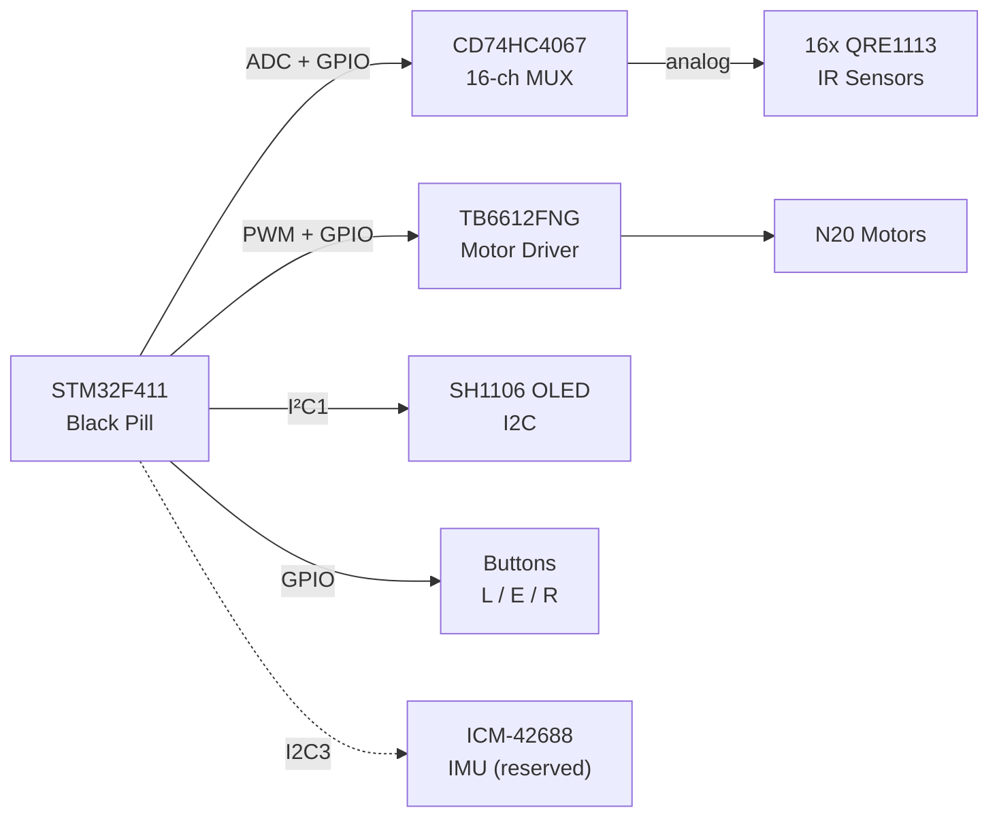
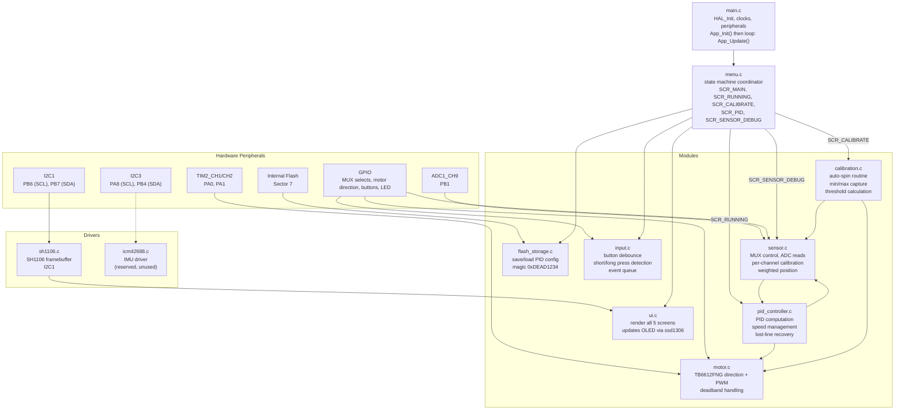
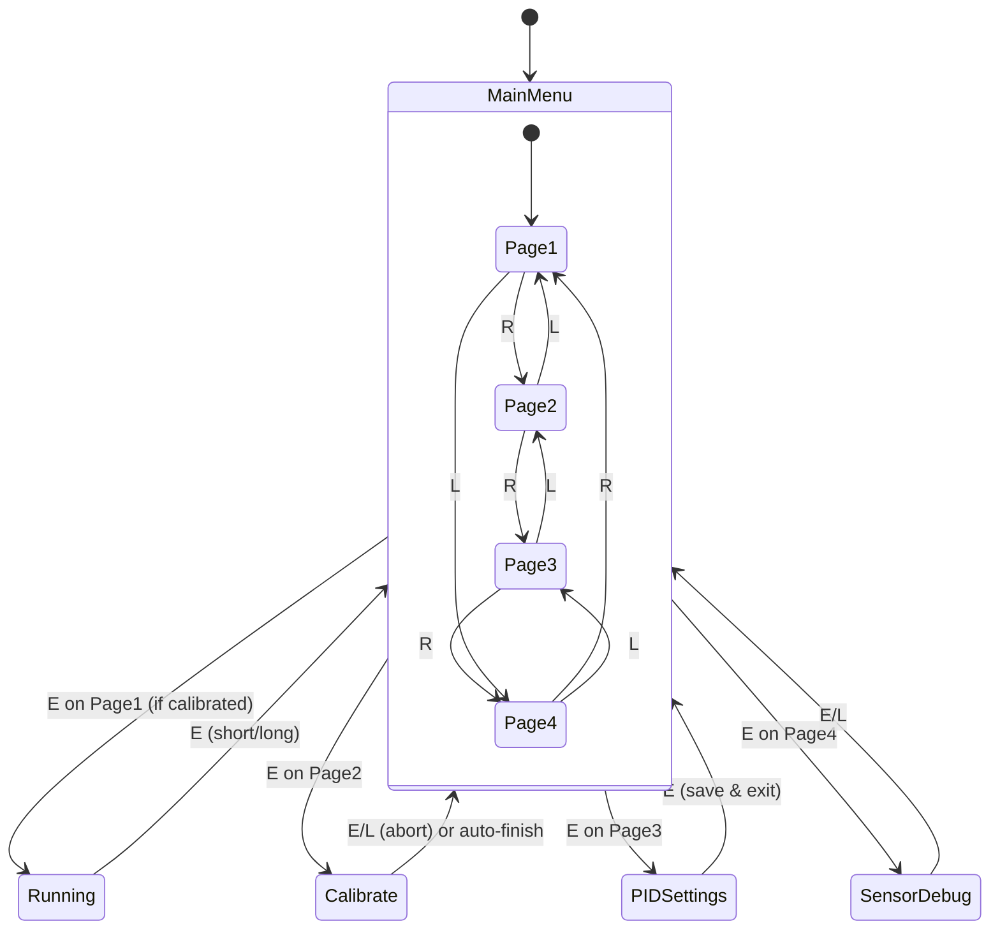
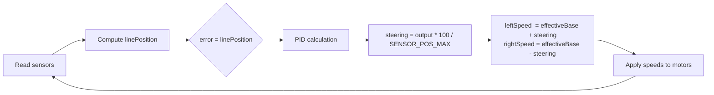
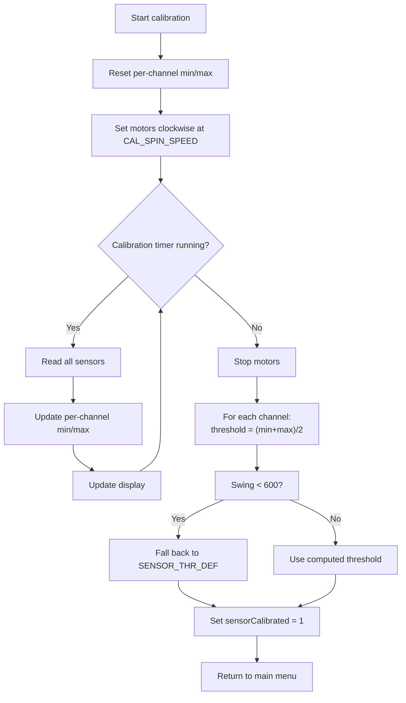

# Line Follower — STM32F411CE

A PID‑based line follower robot firmware for the STM32F411CEU6 (Black Pill), using a 16‑channel QRE1113 SMD IR sensor array, TB6612FNG dual motor driver, and a 1.3" SH1106 OLED display.

---

## Table of Contents

- [Hardware Overview](#hardware-overview)
- [Pin Mapping](#pin-mapping)
- [Firmware Architecture](#firmware-architecture)
- [Application Screens](#application-screens)
- [Key Algorithms](#key-algorithms)
  - [Sensor Reading & Position Calculation](#sensor-reading--position-calculation)
  - [PID Controller](#pid-controller)
  - [Speed Management](#speed-management)
  - [Lost‑Line Recovery](#lost-line-recovery)
  - [Auto‑Calibration](#auto-calibration)
- [Persistent Storage](#persistent-storage)
- [Build & Flashing](#build--flashing)
- [How It's Coded — STM32 for Arduino/ESP32 Developers](#how-its-coded--stm32-for-arduinoesp32-developers)
- [Tuning Guide](#tuning-guide)
- [Compile‑Time Constants](#compile-time-constants)
- [Future Improvements](#future-improvements)

---

## Hardware Overview

The robot is built around the **STM32F411CEU6** (Black Pill) and interfaces with the following peripherals:

| Component          | Part              | Notes                                    |
|--------------------|-------------------|------------------------------------------|
| MCU                | STM32F411CEU6     | 100 MHz Cortex‑M4F                       |
| IR sensors         | QRE1113 SMD ×16   | Multiplexed through CD74HC4067SM         |
| Analog MUX         | CD74HC4067SM      | 16‑channel                               |
| Motor driver       | TB6612FNG         | Dual H‑bridge, 1.2 A continuous          |
| Motors             | N20 1000 RPM 12 V | With gearbox (can be swapped for 6 V)    |
| Display            | SH1106 1.3" OLED  | 128×64, I²C                              |
| IMU                | ICM-42688         | I²C (reserved, unused in current firmware) |

**System Block Diagram**



---

## Pin Mapping

### Motor Driver (TB6612FNG)

| Signal | Pin   | Description               |
|--------|-------|---------------------------|
| AIN1   | PA2   | Left motor direction 1    |
| AIN2   | PA3   | Left motor direction 2    |
| PWMA   | PA0   | Left motor PWM (TIM2_CH1) |
| BIN1   | PC14  | Right motor direction 1   |
| BIN2   | PC15  | Right motor direction 2   |
| PWMB   | PA1   | Right motor PWM (TIM2_CH2)|
| STBY   | PA4   | Standby (LOW = coast, HIGH = enable) |

### Sensor MUX (CD74HC4067SM)

| Signal | Pin   | Description                     |
|--------|-------|---------------------------------|
| S0     | PB0   | Channel select bit 0            |
| S1     | PA7   | Channel select bit 1            |
| S2     | PA6   | Channel select bit 2            |
| S3     | PA5   | Channel select bit 3            |
| SIG    | PB1   | Analog signal (ADC1_CH9)        |

**Sensor layout:**  
I0 (rightmost, curved) → I15 (leftmost, curved).  
I0–I1 and I14–I15 are curved outward; I2–I13 are straight with 8 mm pitch.

### Display (SH1106 OLED)

| Signal | Pin   | Description |
|--------|-------|-------------|
| SCL    | PB6   | I²C1 clock  |
| SDA    | PB7   | I²C1 data   |

### IMU (ICM-42688) – Reserved

| Signal | Pin   | Description |
|--------|-------|-------------|
| SCL    | PA8   | I²C3 clock  |
| SDA    | PB4   | I²C3 data   |

### Buttons & Indicator

| Signal | Pin   | Description                         |
|--------|-------|-------------------------------------|
| L      | PB12  | Navigate left / decrease value      |
| E      | PB13  | Confirm / short or long press       |
| R      | PB14  | Navigate right / increase value     |
| LED    | PB10  | Status indicator                    |

---

## Firmware Architecture

The firmware uses a **flat event‑driven state machine**. `main.c` initialises peripherals and calls `App_Update()` in a tight loop. All application logic is split into focused modules.



### Module Responsibilities

| File                 | Responsibility                                           |
|----------------------|----------------------------------------------------------|
| `menu.c`             | State machine, screen routing, button event dispatch, PID globals |
| `pid_controller.c`   | PID computation, speed management, lost‑line recovery, motor output |
| `sensor.c`           | MUX sequencing, ADC reads, position calculation, calibration data |
| `calibration.c`      | Auto‑spin calibration: drives motors, collects min/max, computes thresholds |
| `motor.c`            | TB6612FNG direction + PWM control                        |
| `input.c`            | Button debouncing, short/long press detection, event queue |
| `ui.c`               | All OLED screen rendering                                |
| `flash_storage.c`    | Save/load PID config to/from internal flash Sector 7     |
| `sh1106.c`           | Low‑level SH1106 I²C driver (page‑mode framebuffer)      |
| `icm42688.c`         | ICM‑42688 IMU driver (reserved)                          |

---

## Application Screens

Navigation uses **L / R** buttons to cycle pages and **E** to confirm.  
A **long press of E** from any screen immediately returns to the main menu and stops the motors.



### 1. Main Menu (pages 1–4)

| Page | Content                                   |
|------|-------------------------------------------|
| 1/4  | START RUN – launches line‑following (blocked if not calibrated). Shows Kp/Kd/Speed/Cal status. |
| 2/4  | CALIBRATE – press E to start auto‑spin.  |
| 3/4  | PID SETTINGS – preview current Kp/Ki/Kd/Speed. Press E to enter edit mode. |
| 4/4  | SENSOR DEBUG – enters live sensor value screen. |

### 2. Running Screen (`SCR_RUNNING`)

Displays live data while following the line:
- 16‑sensor binary bar (`*` = on line, `.` = off)
- Pixel‑accurate position bar (proportional to `linePosition`)
- Direction indicator: `<< LEFT`, `CENTRED`, `RIGHT >>`
- Error value and current base speed

Press **E** (short or long) to stop motors and return to main menu.

### 3. Calibration Screen (`SCR_CALIBRATE`)

1. Navigate to page **2/4 CALIBRATE**.
2. Place robot so the sensor array spans both black line and white surface.
3. Press **E** – the spin starts **immediately**.
4. Robot pivots **clockwise** at a fixed speed (`CAL_SPIN_SPEED`) for `CAL_SPIN_MS` while recording min/max ADC values.
5. Motors stop automatically, per‑channel thresholds are computed, and the display returns to the main menu with `Status:[CALIBRATED]`.

During spin the display shows:
- Live sensor bar (which sensors currently see the line)
- Per‑sensor confidence bar (filled block = that channel has seen enough ADC swing)
- `Ready: X/16` count
- Countdown timer

Press **E or L** at any time to **abort** (motors stop, calibration data discarded).

### 4. PID Tuning Screen (`SCR_PID`)

Adjust the four PID parameters live:

| Field | Step  | Range      |
|-------|-------|------------|
| Kp    | ±0.10 | 0.0 – 10.0 |
| Ki    | ±0.01 | 0.0 – 2.0  |
| Kd    | ±0.05 | 0.0 – 5.0  |
| Speed | ±5%   | 0 – 100%   |

- **L/R** moves the cursor between fields.
- **E** toggles edit mode on the selected field (cursor shows `>` idle, `*` editing).
- Scroll to the **SAVE** row and press **E** to write to flash (persists across power cycles).

### 5. Sensor Debug Screen (`SCR_SENSOR_DEBUG`)

Shows all 16 raw 12‑bit ADC values (0–4095) updating at 10 Hz:

```
 0:XXXX*  8:XXXX.
 1:XXXX.  9:XXXX.
 ...
 7:XXXX. 15:XXXX.
```

`*` = sensor currently above threshold (on line), `.` = off.  
Press **E or L** to return to the main menu.

---

## Key Algorithms

### Sensor Reading & Position Calculation

**Sensor Placement & Position Mapping**

```
    Right (curved)                     Left (curved)
      I0  I1  I2  I3 ... I12 I13 I14 I15
Pos: +8500 +7000 +5500 ... -5500 -7000 -8500
```

Curved sensors (I0‑I1, I14‑I15) are given extra reach (`SENSOR_CURVE_EXTRA = 500 units`) to improve corner detection.

**Position Calculation Modes**

- **After calibration (analog mode):**  
  Each sensor contributes a continuous 0.0–1.0 intensity normalised by its own `calMin`/`calMax`. The position is a weighted average, giving sub‑sensor resolution.

- **Before calibration (binary mode):**  
  Each sensor contributes 0 or 1 based on the global `SENSOR_THR_DEF = 2048`. Position is the average of all active sensor positions.

### PID Controller

**Control Loop**



**Formula**

```
error = linePosition
output = Kp × error + Ki × integral + Kd × derivative
steering = output × (100 / SENSOR_POS_MAX)

leftSpeed  = effectiveBase + steering
rightSpeed = effectiveBase - steering
```

- **Derivative** is low‑pass filtered with `DERIV_ALPHA = 0.28` to reduce noise (lower value damps wave-section ripple).
- **Integral** is reset on error sign change to prevent windup and clamped to ±8×`SENSOR_POS_MAX`.

### Speed Management

Three independent multipliers are applied to `baseSpeed`:

**1. Positional corner slowdown (quadratic)**

```
errNorm      = |error| / SENSOR_POS_MAX          // 0.0–1.0
cornerScale  = max(1 − 0.72 × errNorm², 0.22)
```

At 100% error → 28% of base speed. At 50% error → 82%. Never below 22%.

**2. Derivative brake — zigzag / W‑peak sections**

```
derivNorm   = |filtered_deriv| / SENSOR_POS_MAX  // 0.0–1.0
derivScale  = max(1 − 0.60 × derivNorm², 0.35)
```

When the error is changing rapidly (sharp reversal peaks), this applies a second independent slowdown on top of the positional corner scale. The two effects multiply.

**3. Straight‑line boost**  
When `errNorm < 0.15` (well centred), speed is boosted up to +20%.

```
effectiveBase = baseSpeed × cornerScale × derivScale × boost
```

### Lost‑Line Recovery

When `sensorActiveCount == 0` (no sensor sees the line):

| Phase      | Duration    | Behaviour                                               |
|------------|-------------|---------------------------------------------------------|
| Coast      | 0–110 ms    | Hold last motor command – bridges dashed‑line gaps      |
| Pivot      | 110–500 ms  | Pivot (22%) toward last‑known side                      |
| Hard brake | >500 ms     | Stop – fell off track or course end                     |

> The 110 ms coast window is sized to bridge the ~25 mm dashed‑rectangle gaps at ≥30% speed.

### Auto‑Calibration

**Flowchart**



During the 5‑second spin, the robot records the minimum and maximum ADC value seen by each sensor. The threshold for each channel is the average of its min and max. Channels with insufficient swing (<600 counts) fall back to the global `SENSOR_THR_DEF`.

---

## Persistent Storage

PID configuration is stored in **Sector 7** of the internal flash (`0x08060000`), the last 128 KB sector. This avoids overlap with the firmware image (sectors 0–6).

A `0xDEAD1234` magic number validates the stored data. On first boot (or after a full chip erase), defaults from `menu.c` are used:

```c
PIDConfig pid = {2.0f, 0.0f, 3.0f, 30};  // Kp, Ki, Kd, Speed%
```

> **Note:** Do not call `FlashStorage_Save()` while motors are running. The sector erase takes ~1 ms and stalls the CPU. The PID tuning screen is only accessible when stopped.

---

## Build & Flashing

Built with **STM32CubeIDE** / **CMake + arm‑none‑eabi‑gcc 14.3**.

```bash
cmake --preset Debug
cmake --build build/Debug
```

Flash with ST‑Link via STM32CubeIDE or:

```bash
openocd -f interface/stlink.cfg -f target/stm32f4x.cfg \
        -c "program build/Debug/LineFollower.elf verify reset exit"
```

---

## How It's Coded — STM32 for Arduino/ESP32 Developers

This section is for anyone who has written Arduino or ESP32 code and wants to understand what is actually happening in a bare-metal STM32 HAL project. The concepts are the same — read pins, drive PWM, talk I2C — but the plumbing is more explicit and you have to manage it yourself.

---

### 1. There is No `setup()` / `loop()` — Just `main()`

Arduino hides a `main()` from you and calls your `setup()` once and `loop()` forever. On STM32 you write `main()` directly. The pattern is identical but you see every step:

```c
int main(void)
{
    HAL_Init();              // configure SysTick, set interrupt priority grouping
    SystemClock_Config();    // configure HSE + PLL  →  96 MHz
    MX_GPIO_Init();          // enable clocks, configure all GPIO pins
    MX_ADC1_Init();          // set up ADC1 channel 9 on PB1
    MX_I2C1_Init();          // set up I2C1 at 400 kHz (OLED)
    MX_TIM2_Init();          // set up TIM2 PWM at 20 kHz

    App_Init();              // application-level init (your "setup")
    while (1) {
        App_Update();        // application polling loop (your "loop")
    }
}
```

STM32CubeIDE generates the `MX_*_Init()` functions from the `.ioc` GUI. You never write register addresses by hand — the HAL handles that.

---

### 2. Clock Configuration — You Have to Ask for Your Speed

Arduino runs at a fixed clock (16 MHz on Uno, 240 MHz on ESP32). On STM32 the chip boots from the internal 16 MHz RC oscillator and you explicitly configure the PLL to reach your target speed.

This project uses a 12 MHz external crystal (HSE) and multiplies it up to 96 MHz:

```c
// Inside SystemClock_Config() — generated by STM32CubeIDE
RCC_OscInitStruct.OscillatorType = RCC_OSCILLATORTYPE_HSE;
RCC_OscInitStruct.HSEState       = RCC_HSE_ON;
RCC_OscInitStruct.PLL.PLLState   = RCC_PLL_ON;
RCC_OscInitStruct.PLL.PLLSource  = RCC_PLLSOURCE_HSE;
RCC_OscInitStruct.PLL.PLLM       = 12;   // divide HSE by 12  →  1 MHz
RCC_OscInitStruct.PLL.PLLN       = 96;   // multiply by 96    →  96 MHz VCO
RCC_OscInitStruct.PLL.PLLP       = RCC_PLLP_DIV2;  // SYSCLK = 96 / 2 = 48 MHz
//  (PLLP=2 gives 48 MHz here — HAL sets FLASH wait states accordingly)
```

If you skip this, peripherals will run at the wrong speed and I2C/UART baud rates will be wrong.

---

### 3. Peripheral Handles — Every Peripheral Is a Struct

Arduino uses global objects like `Wire` or `Serial`. HAL uses *handle structs* that carry all the configuration and state for one peripheral instance.

```c
// Declared in main.c, used everywhere via extern
ADC_HandleTypeDef  hadc1;   // the one ADC used to read all 16 sensors
I2C_HandleTypeDef  hi2c1;   // I2C1 bus  →  SH1106 OLED
TIM_HandleTypeDef  htim2;   // TIM2  →  PWM for both motors
```

Any source file that needs a peripheral just declares `extern ADC_HandleTypeDef hadc1;` and passes a pointer to it:

```c
HAL_ADC_Start(&hadc1);   // always &handle, never a global object
```

---

### 4. ADC — Three Steps Instead of One

Arduino: `int val = analogRead(A0);`

STM32 HAL: you start the conversion, wait for it to finish, then read the result:

```c
// From sensor.c — reads the single shared ADC channel (PB1 / CH9)
static uint16_t ADC_ReadPB1(void)
{
    HAL_ADC_Start(&hadc1);                           // trigger one conversion
    if (HAL_ADC_PollForConversion(&hadc1, 5) != HAL_OK)
        return 0;                                    // timed out (5 ms limit)
    return (uint16_t)HAL_ADC_GetValue(&hadc1);       // 12-bit result: 0–4095
}
```

Because there is only one ADC pin wired to a 16-channel multiplexer (CD74HC4067), before each read the firmware selects which sensor to connect:

```c
static void MUX_Select(uint8_t ch)   // ch = 0..15
{
    HAL_GPIO_WritePin(MUX_S0_GPIO_Port, MUX_S0_Pin, (ch >> 0) & 1);
    HAL_GPIO_WritePin(MUX_S1_GPIO_Port, MUX_S1_Pin, (ch >> 1) & 1);
    HAL_GPIO_WritePin(MUX_S2_GPIO_Port, MUX_S2_Pin, (ch >> 2) & 1);
    HAL_GPIO_WritePin(MUX_S3_GPIO_Port, MUX_S3_Pin, (ch >> 3) & 1);
    for (volatile int t = 0; t < 50; t++) { __NOP(); }  // ~500 ns settle
}
```

This is a common technique when you want more analog inputs than the MCU has ADC channels.

---

### 5. PWM — Timers, Not `analogWrite`

Arduino's `analogWrite(pin, 0–255)` hides an 8-bit timer. STM32 exposes the timer directly, which gives you full control over frequency and resolution.

TIM2 is configured for 20 kHz PWM with 1000 steps of resolution (ARR = 999). To start PWM:

```c
// From motor.c
void Motor_Enable(void)
{
    HAL_TIM_PWM_Start(&htim2, TIM_CHANNEL_1);   // left  motor on PA0
    HAL_TIM_PWM_Start(&htim2, TIM_CHANNEL_2);   // right motor on PA1
    HAL_GPIO_WritePin(STNBY_GPIO_Port, STNBY_Pin, GPIO_PIN_SET);  // driver standby off
}
```

To change speed mid-run without reconfiguring the timer, use the compare register macro:

```c
__HAL_TIM_SET_COMPARE(&htim2, TIM_CHANNEL_1, 650);  // 65% duty on left motor
__HAL_TIM_SET_COMPARE(&htim2, TIM_CHANNEL_2, 800);  // 80% duty on right motor
```

Direction is a separate GPIO pair (AIN1/AIN2 for the TB6612FNG), not encoded in the PWM value.

---

### 6. GPIO — Same Idea, More Verbose

Arduino: `digitalRead(pin)` / `digitalWrite(pin, HIGH)`

STM32: you pass a port pointer and a pin bitmask. The `*_GPIO_Port` / `*_Pin` symbols are generated by STM32CubeIDE from pin names you set in the `.ioc` file:

```c
// Read a button (active-low — returns 0 when pressed)
uint8_t pressed = !HAL_GPIO_ReadPin(E_But_GPIO_Port, E_But_Pin);

// Drive a GPIO output
HAL_GPIO_WritePin(AIN1_GPIO_Port, AIN1_Pin, GPIO_PIN_SET);
HAL_GPIO_WritePin(AIN2_GPIO_Port, AIN2_Pin, GPIO_PIN_RESET);
```

---

### 7. Timing — `HAL_GetTick()` Is Your `millis()`

Arduino: `millis()` / `delay()`

`HAL_GetTick()` returns the same millisecond tick counter. **Never use `HAL_Delay()` inside the main loop** — it blocks everything, including the sensor reader and the OLED updater.

All timing in this project is non-blocking:

```c
// From input.c — debounce without blocking
void Input_Update(void)
{
    uint32_t now = HAL_GetTick();
    uint8_t  L   = !HAL_GPIO_ReadPin(L_But_GPIO_Port, L_But_Pin);

    if (L && (now - lastL) >= BTN_DEBOUNCE_MS) {
        lastL = now;
        lastEvent = BTN_LEFT;
    }
}
```

The pattern `(now - lastL) >= threshold` is safe even when the 32-bit counter wraps at ~49 days, because unsigned subtraction handles the wrap-around correctly.

---

### 8. I2C — Byte Buffers Instead of `Wire.write()`

Arduino `Wire` library: `Wire.beginTransmission(addr)` → `Wire.write(byte)` → `Wire.endTransmission()`

HAL I2C: you build a byte buffer yourself and hand it to one blocking call:

```c
// From sh1106.c — send a command byte to the OLED
static void sh1106_WriteCommand(uint8_t cmd)
{
    uint8_t buf[2] = { 0x00, cmd };    // 0x00 = Co bit clear, D/C# = 0 → command
    HAL_I2C_Master_Transmit(&hi2c1,
                             SH1106_I2C_ADDR << 1,  // HAL needs address shifted left by 1
                             buf, 2,
                             HAL_MAX_DELAY);
}
```

Note the `address << 1` — HAL uses the 8-bit form (7-bit address + R/W bit space), so you always shift the 7-bit address you find in a datasheet.

---

### 9. Flash Storage — Manual Unlock → Erase → Write → Lock

Arduino has `EEPROM.write(addr, val)` which handles everything. STM32F4 has no dedicated EEPROM — it repurposes a flash sector instead. Flash has a rule: you can only flip bits from 1 to 0 (write), never 0 to 1. That means you must **erase the entire sector first** (sets all bits back to 1) before writing new data.

```c
// From flash_storage.c — save PID config to Sector 7
HAL_FLASH_Unlock();

FLASH_EraseInitTypeDef eraseInit = {
    .TypeErase    = FLASH_TYPEERASE_SECTORS,
    .Sector       = FLASH_SECTOR_7,
    .NbSectors    = 1,
    .VoltageRange = FLASH_VOLTAGE_RANGE_3,   // 2.7–3.6 V supply
};
uint32_t sectorError = 0;
HAL_FLASHEx_Erase(&eraseInit, &sectorError);

// Write word by word (4 bytes at a time)
HAL_FLASH_Program(FLASH_TYPEPROGRAM_WORD, STORAGE_ADDR, dataWord);

HAL_FLASH_Lock();   // always re-lock to protect flash from accidental writes
```

To read back, you just cast the sector address to a pointer — flash is memory-mapped:

```c
const volatile FlashData *stored = (const volatile FlashData *)0x08060000UL;
float kp = stored->Kp;   // direct read, no HAL function needed
```

---

### 10. No `Serial.print` — The OLED Is Your Debug Console

Arduino developers often scatter `Serial.print()` calls to trace values. On this board there is no USB-serial bridge, so the SH1106 OLED serves that role. The **Sensor Debug** screen (hold Enter on the main menu) shows all 16 raw ADC values live at 10 Hz.

For deeper debugging during development you can use **SWO/ITM printf** over the SWD debug port (requires a debug probe like ST-Link V2), but that is a compile-time addition and not included in the release build.

---

### Mental Model Summary

| Arduino / ESP32 concept | STM32 HAL equivalent |
|-------------------------|----------------------|
| `setup()` + `loop()` | `main()` → `MX_*_Init()` → `while(1){}` |
| Runs at fixed clock | Must call `SystemClock_Config()` |
| `analogRead(pin)` | `HAL_ADC_Start` → `PollForConversion` → `GetValue` |
| `analogWrite(pin, val)` | `HAL_TIM_PWM_Start` + `__HAL_TIM_SET_COMPARE` |
| `digitalRead/Write` | `HAL_GPIO_ReadPin` / `HAL_GPIO_WritePin` |
| `millis()` / `delay()` | `HAL_GetTick()` / never block the loop |
| `Wire.write(byte)` | `HAL_I2C_Master_Transmit(&hi2c, addr<<1, buf, len, timeout)` |
| `EEPROM.write(addr, val)` | Unlock → Erase sector → Program words → Lock |
| `Serial.print()` | OLED display or SWO ITM printf over SWD |

---

## Tuning Guide

### First Run

1. Flash firmware. Robot displays main menu.
2. Navigate to **CALIBRATE** (page 2/4 with **R**).
3. Place robot so sensors span both black line and white background.
4. Press **E** – robot immediately spins clockwise for 5 seconds.
5. Watch the confidence bar fill – all 16 blocks should fill. If some don't, the array isn't reaching both surfaces during the spin.
6. After auto‑return to main menu, `Status:[CALIBRATED]` and `Cal: DONE` appear.
7. Navigate to **PID** (page 3/4). Start with: `Kp=1.5`, `Ki=0.00`, `Kd=0.00`, `Speed=30`.
8. Return to page 1/4 and press **E** to start running.

### Suggested Tuning Sequence

| Step | Action |
|------|--------|
| 1    | Kp=1.5, Ki=0, Kd=0, Speed=30 – robot wobbles but follows |
| 2    | Raise Kp until oscillation starts, back off ~20% |
| 3    | Raise Kd until oscillation stops – this is your main handle |
| 4    | Raise Speed, increase Kd again if wobbling returns |
| 5    | Add Ki (0.01–0.05) only if robot drifts persistently to one side |

### Geometry Tuning

If the robot cuts sharp corners, the curved sensors are reporting a position that is smaller (closer to centre) than the real physical position. Increase `SENSOR_CURVE_EXTRA` in `sensor.h` (default: 500 units = ~4 mm extra reach per curved step).

---

## Compile‑Time Constants

| Constant              | File                 | Default | Description                                         |
|-----------------------|----------------------|---------|-----------------------------------------------------|
| `SENSOR_CURVE_EXTRA`  | `sensor.h`           | 500     | Extra position units per curved sensor step         |
| `SENSOR_THR_DEF`      | `sensor.h`           | 2048    | Global fallback ADC threshold (pre‑calibration)     |
| `CAL_SPIN_MS`         | `calibration.c`      | 5000    | Calibration spin duration (ms)                      |
| `CAL_SPIN_SPEED`      | `calibration.c`      | 20      | Calibration spin speed (%)                          |
| `DERIV_ALPHA`         | `pid_controller.c`   | 0.28    | Derivative low‑pass filter (lower = smoother)       |
| `CORNER_DROP`         | `pid_controller.c`   | 0.72    | Positional corner slowdown factor                   |
| `CORNER_MIN`          | `pid_controller.c`   | 0.22    | Minimum positional speed scale (floor)              |
| `DERIV_BRAKE_DROP`    | `pid_controller.c`   | 0.60    | Derivative brake drop factor (zigzag peaks)         |
| `DERIV_BRAKE_MIN`     | `pid_controller.c`   | 0.35    | Minimum derivative brake scale (floor)              |
| `STRAIGHT_THR`        | `pid_controller.c`   | 0.15    | Centred‑line threshold for straight boost           |
| `CUT_COAST_MS`        | `pid_controller.c`   | 110     | Coast duration (ms) – bridges dashed‑line gaps      |
| `CUT_SEARCH_MS`       | `pid_controller.c`   | 500     | Max pivot search duration before hard brake (ms)    |
| `CUT_SEARCH_SPD`      | `pid_controller.c`   | 22      | Pivot search speed (%)                              |
| `MOTOR_DEADBAND`      | `motor.c`            | 150     | Minimum PWM tick to overcome motor stiction         |

---

## Future Improvements

- **Splash Screen** – A 128×64 1‑bit bitmap can be shown on boot.  
  To add one:
  1. Prepare a 128×64 black‑and‑white image.
  2. Convert it to a C byte array using [image2cpp](https://javl.github.io/image2cpp/) (Horizontal, 1 bit per pixel).
  3. Save the output as `Core/Inc/splash.h`.
  4. Call `sh1106_DrawBitmap()` inside `App_Init()` followed by `HAL_Delay(3000)`.

- **IMU Integration** – Use the ICM‑42688 for hill detection or improved cornering.

- **WiFi/BLE Telemetry** – Stream live sensor data and PID values.

---